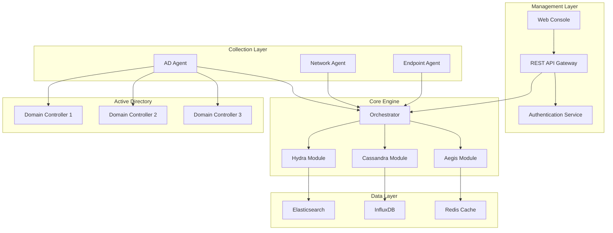
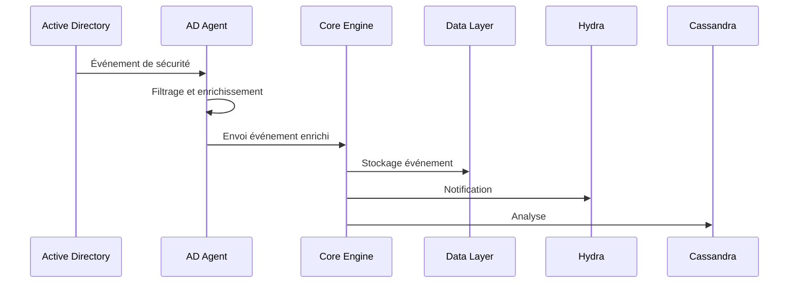
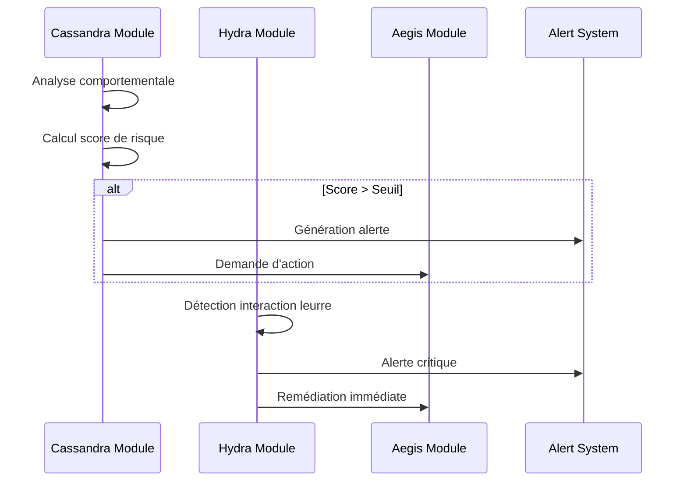
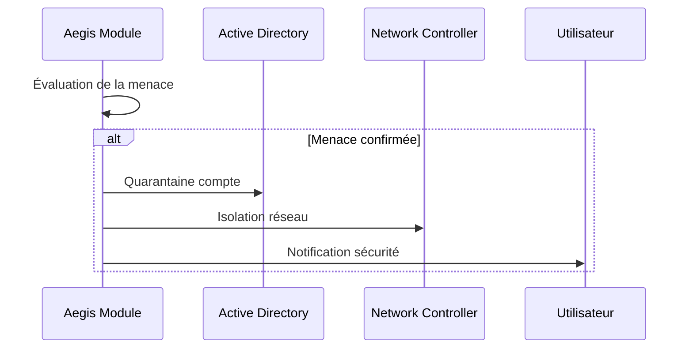

# Architecture Orion AD Guardian

## Vue d'Ensemble

Orion est conçu comme un système distribué modulaire qui s'intègre de manière transparente avec l'infrastructure Active Directory existante. L'architecture suit les principes de microservices avec une approche défense en profondeur.

## Diagramme d'Architecture Globale



## Composants Principaux

### 1. Couche de Gestion (Management Layer)

#### Web Console
- **Technologie**: React 18 + TypeScript
- **Fonctionnalités**:
  - Dashboard temps réel
  - Gestion des alertes
  - Configuration des modules
  - Rapports et analytics
  - Gestion des utilisateurs

#### API Gateway
- **Technologie**: FastAPI (Python 3.11+)
- **Fonctionnalités**:
  - Authentification JWT
  - Rate limiting
  - Validation des requêtes
  - Routing intelligent
  - Logging et monitoring

#### Service d'Authentification
- **Technologie**: OAuth 2.0 + OpenID Connect
- **Fonctionnalités**:
  - SSO avec Active Directory
  - Multi-factor authentication
  - Gestion des rôles et permissions
  - Audit des accès

### 2. Moteur Principal (Core Engine)

#### Orchestrateur
- **Rôle**: Coordinateur central de tous les modules
- **Fonctionnalités**:
  - Gestion du workflow de détection
  - Coordination inter-modules
  - Gestion des priorités
  - Load balancing

#### Module Hydra (Déception)

```python
class HydraModule:
    def __init__(self):
        self.decoy_manager = DecoyManager()
        self.interaction_detector = InteractionDetector()
        self.poison_injector = PoisonInjector()
    
    async def deploy_decoys(self, domain: str, count: int) -> List[DecoyEntity]:
        """Déploie des leurres dans le domaine AD"""
        pass
    
    async def detect_interactions(self) -> List[SuspiciousActivity]:
        """Détecte les interactions avec les leurres"""
        pass
```

**Sous-composants**:
- **DecoyManager**: Création et maintenance des leurres
- **InteractionDetector**: Détection d'interactions suspectes
- **PoisonInjector**: Injection de données empoisonnées
- **EvolutionEngine**: Évolution réaliste des leurres

#### Module Cassandra (Analyse IA)

```python
class CassandraModule:
    def __init__(self):
        self.behavioral_analyzer = BehavioralAnalyzer()
        self.risk_scorer = RiskScorer()
        self.pattern_detector = PatternDetector()
        self.ml_engine = MLEngine()
    
    async def analyze_behavior(self, events: List[SecurityEvent]) -> RiskAssessment:
        """Analyse comportementale en temps réel"""
        pass
    
    async def predict_threat(self, user_context: UserContext) -> ThreatPrediction:
        """Prédiction de menaces basée sur l'IA"""
        pass
```

**Sous-composants**:
- **BehavioralAnalyzer**: Analyse des patterns comportementaux
- **RiskScorer**: Calcul de scores de risque dynamiques
- **PatternDetector**: Détection de patterns d'attaque
- **MLEngine**: Moteur d'apprentissage automatique

#### Module Aegis (Remédiation)

```python
class AegisModule:
    def __init__(self):
        self.quarantine_manager = QuarantineManager()
        self.network_controller = NetworkController()
        self.rollback_engine = RollbackEngine()
        self.response_orchestrator = ResponseOrchestrator()
    
    async def quarantine_entity(self, entity_id: str, level: QuarantineLevel) -> None:
        """Met en quarantaine une entité compromise"""
        pass
    
    async def apply_micro_segmentation(self, network_policy: NetworkPolicy) -> None:
        """Applique une micro-segmentation réseau"""
        pass
```

**Sous-composants**:
- **QuarantineManager**: Gestion des quarantaines intelligentes
- **NetworkController**: Contrôle de la segmentation réseau
- **RollbackEngine**: Annulation de modifications malveillantes
- **ResponseOrchestrator**: Orchestration des réponses

### 3. Couche de Données (Data Layer)

#### Elasticsearch
- **Usage**: Stockage et recherche des événements de sécurité
- **Configuration**:
  ```yaml
  cluster.name: orion-security
  node.name: orion-node-1
  network.host: 0.0.0.0
  discovery.type: single-node
  xpack.security.enabled: true
  xpack.security.transport.ssl.enabled: true
  ```

#### InfluxDB
- **Usage**: Données de télémétrie et métriques temporelles
- **Rétention**: 
  - Données brutes: 30 jours
  - Données agrégées: 1 an
  - Données historiques: 5 ans

#### Redis
- **Usage**: Cache pour les sessions et données temporaires
- **Configuration**:
  - Clustering pour haute disponibilité
  - Persistence activée
  - Chiffrement TLS

### 4. Couche de Collecte (Collection Layer)

#### Agent Active Directory
- **Technologie**: C# (.NET 6)
- **Déploiement**: Service Windows sur chaque DC
- **Fonctionnalités**:
  - Monitoring des logs de sécurité
  - Collecte d'événements LDAP
  - Surveillance des modifications d'objets
  - Monitoring Kerberos

```csharp
public class ADAgent : WindowsService
{
    private readonly IEventCollector _eventCollector;
    private readonly ILdapMonitor _ldapMonitor;
    private readonly IKerberosMonitor _kerberosMonitor;
    
    protected override async Task ExecuteAsync(CancellationToken stoppingToken)
    {
        await Task.WhenAll(
            _eventCollector.StartAsync(stoppingToken),
            _ldapMonitor.StartAsync(stoppingToken),
            _kerberosMonitor.StartAsync(stoppingToken)
        );
    }
}
```

#### Agent Réseau
- **Technologie**: Go
- **Fonctionnalités**:
  - Analyse du trafic réseau
  - Détection de patterns suspects
  - Monitoring DNS
  - Analyse des connexions

#### Agent Endpoint
- **Technologie**: C++/Rust
- **Fonctionnalités**:
  - Monitoring des processus
  - Détection d'outils d'attaque
  - Analyse comportementale
  - Protection contre l'exfiltration

## Flux de Données

### 1. Collecte


### 2. Analyse et Détection


### 3. Remédiation


## Patterns de Conception

### 1. Event Sourcing
Tous les événements sont stockés comme une séquence immutable, permettant:
- Reconstruction de l'état à tout moment
- Audit complet
- Analyse forensique
- Rejeu d'événements

### 2. CQRS (Command Query Responsibility Segregation)
Séparation des opérations de lecture et d'écriture:
- **Commands**: Modifications de l'état
- **Queries**: Lecture optimisée
- **Projections**: Vues matérialisées

### 3. Circuit Breaker
Protection contre les défaillances en cascade:
```python
class CircuitBreaker:
    def __init__(self, failure_threshold: int, timeout: int):
        self.failure_threshold = failure_threshold
        self.timeout = timeout
        self.failure_count = 0
        self.state = 'CLOSED'
        self.last_failure_time = None
    
    async def call(self, func: Callable) -> Any:
        if self.state == 'OPEN':
            if time.time() - self.last_failure_time > self.timeout:
                self.state = 'HALF_OPEN'
            else:
                raise CircuitBreakerOpenException()
        
        try:
            result = await func()
            self.on_success()
            return result
        except Exception as e:
            self.on_failure()
            raise e
```

## Sécurité de l'Architecture

### 1. Chiffrement
- **Transport**: TLS 1.3 pour toutes les communications
- **Stockage**: AES-256 pour les données sensibles
- **Clés**: Rotation automatique tous les 90 jours

### 2. Authentification
- **Mutuelle**: Tous les composants s'authentifient mutuellement
- **Certificats**: PKI interne avec autorité de certification
- **Tokens**: JWT avec durée de vie courte

### 3. Autorisation
- **RBAC**: Contrôle d'accès basé sur les rôles
- **Principe du moindre privilège**: Accès minimal nécessaire
- **Audit**: Logging de tous les accès

### 4. Monitoring de Sécurité
- **Intrusion Detection**: Surveillance de l'infrastructure Orion
- **Anomaly Detection**: Détection d'anomalies dans les composants
- **Health Checks**: Vérification continue de l'intégrité

## Scalabilité et Performance

### 1. Scalabilité Horizontale
- **Agents**: Déploiement multi-instances
- **Core Engine**: Clustering avec load balancing
- **Bases de données**: Sharding et réplication

### 2. Optimisations Performance
- **Cache**: Redis pour les données fréquemment accédées
- **Indexation**: Elasticsearch optimisé pour les recherches
- **Compression**: Compression des données historiques
- **Batching**: Traitement par lots des événements

### 3. Monitoring Performance
```yaml
metrics:
  collection:
    - agent_events_per_second
    - core_processing_latency
    - database_query_time
    - memory_usage
    - cpu_usage
  
  alerts:
    - latency > 100ms
    - error_rate > 1%
    - memory_usage > 80%
    - disk_usage > 90%
```

## Déploiement

### 1. Containerisation
Tous les composants sont containerisés avec Docker:

```dockerfile
# Exemple pour le Core Engine
FROM python:3.11-slim

WORKDIR /app
COPY requirements.txt .
RUN pip install -r requirements.txt

COPY src/ ./src/
CMD ["python", "-m", "src.core.main"]
```

### 2. Orchestration
Kubernetes pour l'orchestration:

```yaml
apiVersion: apps/v1
kind: Deployment
metadata:
  name: orion-core
spec:
  replicas: 3
  selector:
    matchLabels:
      app: orion-core
  template:
    metadata:
      labels:
        app: orion-core
    spec:
      containers:
      - name: orion-core
        image: orion/core:latest
        ports:
        - containerPort: 8000
        env:
        - name: DATABASE_URL
          valueFrom:
            secretKeyRef:
              name: orion-secrets
              key: database-url
```

### 3. Infrastructure as Code
Terraform pour la gestion de l'infrastructure:

```hcl
resource "kubernetes_deployment" "orion_core" {
  metadata {
    name = "orion-core"
    namespace = "orion"
  }
  
  spec {
    replicas = 3
    
    selector {
      match_labels = {
        app = "orion-core"
      }
    }
    
    template {
      metadata {
        labels = {
          app = "orion-core"
        }
      }
      
      spec {
        container {
          name  = "orion-core"
          image = "orion/core:latest"
          
          port {
            container_port = 8000
          }
        }
      }
    }
  }
}
```

---

*Cette architecture évolue avec le projet. Consultez la documentation technique pour les dernières mises à jour.*